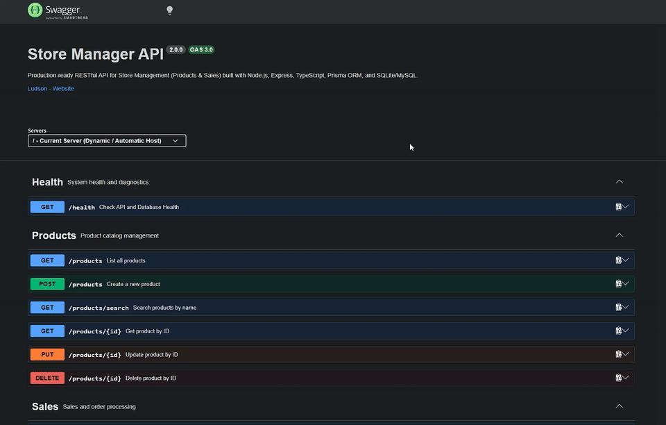
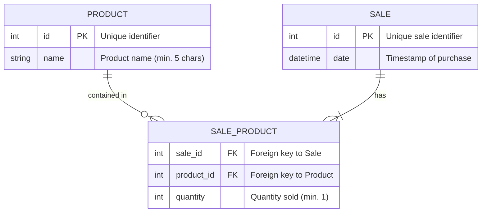

# 🛍️ Store Manager API

[](https://nodejs.org/)
[](https://www.typescriptlang.org/)
[](https://expressjs.com/)
[](https://www.prisma.io/)
[](https://www.mysql.com/)
[](https://www.sqlite.org/)
[](https://www.docker.com/)
[](https://swagger.io/)
[](https://github.com/features/actions)
[](https://opensource.org/licenses/MIT)

> 🇺🇸 **English** | 🇧🇷 [**Versão em Português**](README.md)

Production-ready RESTful API for product inventory management and sales order processing, built with layered architecture (**MSC - Model, Service, Controller**), strict static typing with **TypeScript**, data persistence with **Prisma ORM**, dual support for **MySQL 8.0** and **SQLite**, guaranteed **atomic transactions (ACID)**, and interactive documentation via **Swagger/OpenAPI**.

## 📌 Quick Navigation

- [📝 About The Project](#-about-the-project)
- [🖼️ Preview](#️-preview)
- [🌐 Online Swagger Demonstration](#-online-swagger-demonstration)
- [⚡ API Endpoints](#-api-endpoints)
- [✨ Key Features](#-key-features)
- [🛠️ Technologies and Tools](#️-technologies-and-tools)
- [🏛️ Solution Architecture](#️-solution-architecture)
- [📁 Repository Structure](#-repository-structure)
- [💡 Technical Decisions](#-technical-decisions)
- [🚀 How to Run the Project](#-how-to-run-the-project)
- [📄 License](#-license)

## 📝 About The Project

**Store Manager API** is a backend service designed to simulate real-world retail operations, product inventory control, and checkout processing. The application emphasizes transactional resilience, clean code practices, and production-ready architectural patterns.

Every registered sale processes multiple items atomically: if any item fails validation or refers to a nonexistent product, the entire operation is automatically rolled back, preventing orphaned records and database inconsistencies.

The system natively runs with **MySQL 8.0** for local development and containerized Docker Compose setups, while also providing an optimized **embedded SQLite** configuration for free public demonstration on Render.com with automated database seeding.

## 🖼️ Preview



## 🌐 Online Swagger Demonstration

Access the application in production:
👉 **[Store Manager API - Swagger UI](https://project-store-manager-w8is.onrender.com/api-docs/)**

## ⚡ API Endpoints

The interactive documentation details request payloads, responses, and HTTP status codes. The table below summarizes the available operations:

| Method | Endpoint | Description | Success Status |
| :--- | :--- | :--- | :--- |
| `GET` | `/health` | Healthcheck and database connectivity diagnostic | `200 OK` |
| `GET` | `/api-docs` | Interactive Swagger UI documentation | `200 OK` |
| `GET` | `/products` | Lists all registered products | `200 OK` |
| `GET` | `/products/:id` | Retrieves product details by ID | `200 OK` |
| `GET` | `/products/search?q=:term` | Filters products matching a search query | `200 OK` |
| `POST` | `/products` | Creates a new product in the catalog | `201 Created` |
| `PUT` | `/products/:id` | Updates an existing product name | `200 OK` |
| `DELETE` | `/products/:id` | Removes a product from the database | `204 No Content` |
| `GET` | `/sales` | Lists all sales and item records | `200 OK` |
| `GET` | `/sales/:id` | Retrieves sale details by ID | `200 OK` |
| `POST` | `/sales` | Registers a sale with multiple items (Atomic Transaction) | `201 Created` |
| `PUT` | `/sales/:id` | Updates items and quantities of an existing sale | `200 OK` |
| `DELETE` | `/sales/:id` | Deletes a sale and cascades item deletions | `204 No Content` |

## ✨ Key Features

- **Full Product CRUD**: Create, read, update, and delete catalog items.
- **Text Search for Products**: Dedicated `/products/search?q=term` endpoint handling empty, exact, or partial string matches.
- **Batch Sale Checkout**: Create transactions containing multiple products and quantities in a single request.
- **Atomicity Assurance (ACID)**: Sale workflows run inside `prisma.$transaction(...)`.
- **Referential Integrity**: Sales and products linked with automatic cascade deletion rules.
- **Real-Time Healthcheck**: `/health` endpoint performing an actual database query and reporting uptime metrics.
- **Smart Root Redirect**: Accessing `/` from a web browser automatically redirects straight to the Swagger UI (`/api-docs`).
- **Centralized Error Handling**: Global Express error middleware formatting consistent JSON responses with semantic HTTP status codes (400, 404, 422, 500).

## 🛠️ Technologies and Tools

| Layer / Purpose | Technology | Description |
| :--- | :--- | :--- |
| **Main Language** | **TypeScript 5.7** | Static typing, explicit contracts, and compile-time type safety |
| **Runtime Environment** | **Node.js 20 LTS** | Asynchronous event-driven JavaScript server platform |
| **Web Framework** | **Express 4.21** | Minimalist and fast web framework for building RESTful APIs |
| **ORM / Data Access** | **Prisma ORM 5.22** | Type-safe query builder, schema migrations, and client generation |
| **Databases** | **MySQL 8.0 & SQLite 3** | MySQL for standard environments and SQLite for free Render hosting |
| **Interactive Documentation** | **Swagger UI / OpenAPI 3.0** | Live documentation specification with built-in request testing console |
| **Automated Testing** | **Jest 29 & Supertest 7** | End-to-end integration test suite covering routes, business rules, and DB |
| **Containerization** | **Docker & Docker Compose** | Lightweight multi-stage Alpine build and multi-service orchestration |
| **Continuous Integration** | **GitHub Actions** | Automated CI pipeline running lint, type checks, and integration tests on push |
| **Cloud Hosting** | **Render.com** | Automated blueprint deployments (`render.yaml`) with zero-cost hosting |

## 🏛️ Solution Architecture

The project implements separation of concerns using the **MSC (Model, Service, Controller)** architectural pattern alongside request validation middlewares and global error handling:

```mermaid
flowchart TD
    subgraph ClientLayer["Client Layer"]
        User(["Browser / Swagger UI"])
        ClientApp(["HTTP Clients / Postman"])
    end

    subgraph RouterLayer["Routing & Middlewares"]
        Router["Express Routers (/products, /sales, /health)"]
        CorsMW["CORS Middleware"]
        ValProduct["Product Validation Middleware"]
        ValSale["Sale Validation Middleware"]
        ErrorMW["Global Error Middleware (AppError)"]
    end

    subgraph BusinessLayer["Business Layer (MSC)"]
        Controller["Controllers (ProductsController / SalesController)"]
        Service["Services (ProductsService / SalesService)"]
        Transaction["Atomic Transactions (prisma.$transaction)"]
    end

    subgraph DataLayer["Data Persistence Layer"]
        PrismaClient["Prisma Client (Type-Safe ORM)"]
        MySQL[(MySQL 8.0 - Local / Docker)]
        SQLite[(SQLite 3 - Render / Tests)]
    end

    User -->|Visits /api-docs| Router
    ClientApp -->|REST HTTP Requests| Router
    Router --> CorsMW
    CorsMW --> ValProduct
    CorsMW --> ValSale
    ValProduct --> Controller
    ValSale --> Controller
    Controller --> Service
    Service --> Transaction
    Transaction --> PrismaClient
    PrismaClient -.->|Local / Docker Environment| MySQL
    PrismaClient -.->|Cloud Deploy / Testing| SQLite
    Service -.->|Exceptions (400, 404, 422)| ErrorMW
    ErrorMW -->|Formatted JSON Error| ClientApp
```

### Entity-Relationship Model



## 📁 Repository Structure

```text
├── .github/
│   └── workflows/
│       └── ci.yml               # CI Pipeline (Build and Test on GitHub Actions)
├── prisma/
│   ├── schema.prisma            # Prisma schema for MySQL
│   ├── schema.sqlite.prisma     # Optimized Prisma schema for SQLite on Render
│   └── seed.ts                  # Automated seed script for initial mock data
├── src/
│   ├── config/
│   │   └── prisma.ts            # Shared PrismaClient instance
│   ├── controllers/
│   │   ├── products.controller.ts # Product request handlers
│   │   └── sales.controller.ts    # Sale request handlers
│   ├── docs/
│   │   └── swagger.ts           # OpenAPI 3.0 specification for Swagger UI
│   ├── errors/
│   │   └── AppError.ts          # Custom semantic HTTP error classes
│   ├── middlewares/
│   │   ├── errorHandler.ts      # Global centralized error handler
│   │   ├── validateProduct.ts   # Product validation logic
│   │   └── validateSale.ts      # Sale input and quantity validation
│   ├── routers/
│   │   ├── health.router.ts     # Healthcheck diagnostic route
│   │   ├── products.router.ts   # Product routing
│   │   ├── sales.router.ts      # Sale routing
│   │   └── index.ts             # Centralized route exports
│   ├── services/
│   │   ├── products.service.ts  # Product business rules and data logic
│   │   └── sales.service.ts     # Sale business rules and atomic transactions
│   ├── app.ts                   # Express application setup
│   └── server.ts                # HTTP server startup and network binding
├── tests/
│   ├── health.test.ts           # Healthcheck and root route tests
│   ├── products.test.ts         # Product integration tests
│   ├── sales.test.ts            # Sale integration tests with transactions
│   └── setup.ts                 # Test database isolation setup
├── Dockerfile                   # Multi-stage Dockerfile with pre-seeded SQLite
├── docker-compose.yml           # Multi-container orchestration (MySQL 8 + API)
├── jest.config.js               # Jest configuration for TypeScript
├── package.json                 # Project dependencies, scripts, and metadata
├── render.yaml                  # Render.com Infrastructure-as-Code blueprint
└── tsconfig.json                # Strict TypeScript compiler options
```

## 💡 Technical Decisions

1. **TypeScript Migration**:
   Moving from vanilla JavaScript to TypeScript removed runtime typing errors, standardized data transfer objects (DTOs), and provided automatic code completion matching Prisma schema models.

2. **Atomicity Guarantee via Prisma Interactive Transactions**:
   Registering sales requires inserting into both `sales` and `sales_products`. Using `prisma.$transaction(...)` guarantees that any failure (such as an invalid product ID) immediately rolls back the database without leaving orphan records.

3. **Dual-Database Strategy (MySQL & SQLite)**:
   Enterprise projects rely on robust databases like MySQL, but portfolio projects benefit from zero-cost cloud hosting. By supporting both database engines through separate Prisma schemas, the API runs locally with MySQL and deploys seamlessly to Render using embedded SQLite.

4. **Semantic Exception Architecture**:
   Replacing legacy return objects with typed exceptions (`throw new NotFoundError(...)`) combined with a global `errorHandler` middleware simplified controller logic and unified HTTP responses.

5. **Relative URL Swagger Configuration**:
   Configuring Swagger servers to point to `/` prevents CORS origin errors across localhost, custom ports, and HTTPS Render cloud URLs.

## 🚀 How to Run the Project

### Prerequisites
- **Node.js**: Version 20 LTS (or higher)
- **npm**: Version 9 (or higher)
- **Docker and Docker Compose** *(Optional, for containerized execution)*

### Option 1: Local Execution with Node.js

1. **Clone the repository:**
   ```bash
   git clone https://github.com/ludson96/project-store-manager.git
   cd project-store-manager
   ```

2. **Install dependencies:**
   ```bash
   npm install --legacy-peer-deps
   ```

3. **Configure environment variables:**
   ```bash
   cp .env.example .env
   ```
   *By default, `.env` is configured for **MySQL**. If you prefer to run with **SQLite** locally, uncomment the SQLite line in the `.env` file.*

4. **Prepare the database and initial seed data:**
   - To run with **MySQL** (local server or Docker container running):
     ```bash
     npm run setup:db
     ```
   - To run with **SQLite** (Demonstration mode without a standalone DB server):
     ```bash
     npm run setup:sqlite
     ```

5. **Start the development server:**
   ```bash
   npm run dev
   ```

6. **Open in your browser:**
   - 📖 **Swagger UI**: [http://localhost:3001/api-docs](http://localhost:3001/api-docs)
   - 🩺 **Health Check**: [http://localhost:3001/health](http://localhost:3001/health)

### Option 2: Running with Docker Compose (MySQL + API)

To automatically launch the **MySQL 8.0** database container and the **Store Manager API** container:

```bash
docker-compose up --build -d
```
The API will be available at port `3001` and MySQL data will persist in the named volume `mysql_data`.

### Running Automated Tests

The integration test suite executes against an isolated temporary SQLite database (`prisma/test.db`), allowing you to run tests anytime without having a live MySQL instance running:

```bash
# Run all integration tests
npm test

# Run tests with code coverage report
npm run test:coverage
```

## 📄 License

This project is licensed under the [MIT](LICENSE) License.

<div align="center">
  Developed by <strong>Ludson Pereira dos Santos</strong> 🚀<br />
  <a href="https://www.linkedin.com/in/ludson96/">LinkedIn</a> • <a href="https://github.com/ludson96">GitHub</a> • <a href="mailto:ludson_ps27@hotmail.com">E-mail</a>
</div>
