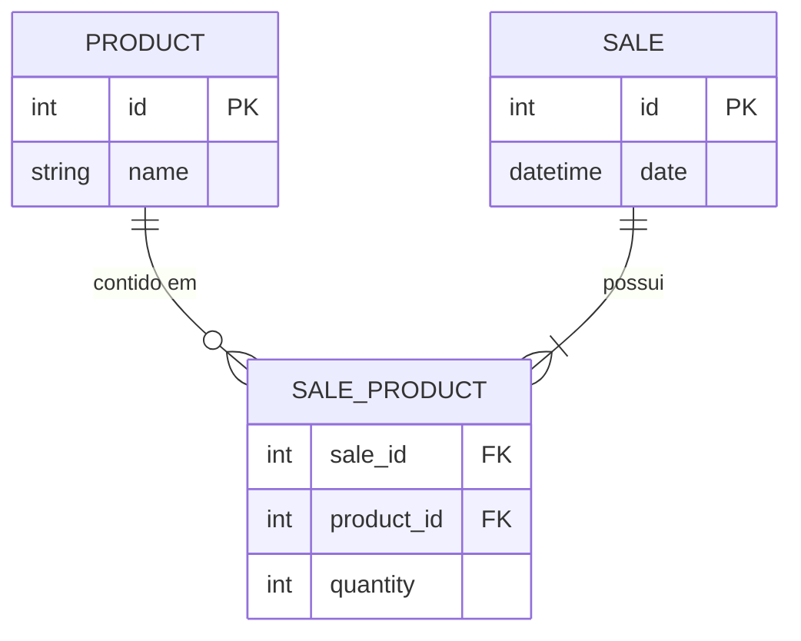

# 🛍️ Store Manager API

[](https://nodejs.org/)
[](https://www.typescriptlang.org/)
[](https://expressjs.com/)
[](https://www.prisma.io/)
[](https://www.sqlite.org/)
[](https://swagger.io/)
[](https://jestjs.io/)
[](https://github.com/features/actions)

API RESTful para gerenciamento de estoque e vendas desenvolvida com **Node.js**, **Express**, **TypeScript** e **Prisma ORM**. O projeto implementa arquitetura em camadas (**MSC - Model, Service, Controller**), garantia de **transações atômicas (ACID)** para operações compostas de venda, documentação interativa com **Swagger/OpenAPI** e testes automatizados de ponta a ponta.

---

## 🎯 Destaques do Projeto

- **Arquitetura em Camadas (MSC)**: Separação estrita de responsabilidades entre Controladores, Serviços de Domínio e Camada de Acesso a Dados.
- **Tipagem Estrita com TypeScript**: Contratos definidos com interfaces, DTOs e tipagem segura do Prisma Client gerado em tempo de compilação.
- **Transações Atômicas com Prisma (`$transaction`)**: O cadastro e atualização de vendas garantem que itens não fiquem órfãos em caso de falha transitória de banco de dados.
- **Tratamento Centralizado de Erros**: Middleware global com classes de exceção HTTP semânticas (`NotFoundError`, `BadRequestError`, `UnprocessableEntityError`).
- **Swagger UI Interativo**: Documentação completa acessível em `/api-docs` para testes manuais sem necessidade de instalar extensões de cliente HTTP.
- **Pronto para a Nuvem**: Configurado para deploy gratuito no **Render.com** com SQLite embutido e seed automático.
- **Integração Contínua (CI)**: Pipeline automatizado no GitHub Actions validando tipagem estática e testes a cada `push`.

---

## 🏛️ Arquitetura e Modelagem

O modelo de dados contempla o relacionamento N:M entre **Produtos** e **Vendas**, mantendo integridade referencial com ações de exclusão em cascata:



---

## 🚀 Endpoints da API

A documentação interativa completa com schemas de payload e respostas está disponível na rota `/api-docs`.

| Método | Endpoint | Descrição | Status Sucesso |
| :--- | :--- | :--- | :--- |
| `GET` | `/health` | Healthcheck da API e conectividade com banco | `200 OK` |
| `GET` | `/api-docs` | Interface Swagger UI | `200 OK` |
| `GET` | `/products` | Lista todos os produtos cadastrados | `200 OK` |
| `GET` | `/products/:id` | Retorna um produto por ID | `200 OK` |
| `GET` | `/products/search?q=:termo` | Busca produtos pelo nome | `200 OK` |
| `POST` | `/products` | Cadastra um novo produto | `201 Created` |
| `PUT` | `/products/:id` | Atualiza o nome de um produto | `200 OK` |
| `DELETE` | `/products/:id` | Remove um produto | `204 No Content` |
| `GET` | `/sales` | Lista todas as vendas e itens vendidos | `200 OK` |
| `GET` | `/sales/:id` | Retorna detalhes de uma venda por ID | `200 OK` |
| `POST` | `/sales` | Registra uma nova venda (transação atômica) | `201 Created` |
| `PUT` | `/sales/:id` | Atualiza itens de uma venda | `200 OK` |
| `DELETE` | `/sales/:id` | Remove uma venda e seus itens associados | `204 No Content` |

---

## 🛠️ Como Executar Localmente

### Pré-requisitos
- **Node.js** >= 18.x (recomendado Node 20 LTS)
- **npm** >= 9.x

### Passo a Passo

1. **Clone o repositório:**
   ```bash
   git clone https://github.com/Ludson96/project-store-manager.git
   cd project-store-manager
   ```

2. **Instale as dependências:**
   ```bash
   npm install --legacy-peer-deps
   ```

3. **Configure as variáveis de ambiente:**
   ```bash
   cp .env.example .env
   ```
   *Por padrão, o projeto vem configurado para **MySQL**. Caso queira testar localmente em modo SQLite idêntico ao Render, basta descomentar a linha do SQLite no `.env`.*

4. **Prepare o banco de dados e dados iniciais (Seed):**
   - Para **MySQL** (com seu container ou servidor local ativo):
     ```bash
     npm run setup:db
     ```
   - Para **SQLite** (Modo Demonstração):
     ```bash
     npm run setup:sqlite
     ```

5. **Inicie o servidor de desenvolvimento:**
   ```bash
   npm run dev
   ```

6. **Acesse:**
   - 📖 Swagger Docs: `http://localhost:3001/api-docs`
   - 🩺 Healthcheck: `http://localhost:3001/health`

---

## 🐳 Execução via Docker (MySQL + API)

Você pode subir tanto o banco **MySQL 8.0** quanto a API juntos via Docker Compose com apenas um comando:

```bash
docker-compose up --build -d
```
Isso inicializará:
- Container `store_manager_mysql` na porta `3306` com volume persistente.
- Container `store_manager_api` na porta `3001` conectado ao MySQL.

---

## 🧪 Suíte de Testes

Os testes automatizados utilizam **Jest** e **Supertest**, cobrindo o fluxo ponta a ponta (rotas, middlewares, controllers e banco de dados real SQLite):

```bash
# Executa todos os testes
npm test

# Executa os testes com relatório de cobertura
npm run test:coverage
```

---

## 🌐 Como Fazer Deploy no Render.com Gratuitamente

Graças ao uso do **SQLite** com **Prisma**, este projeto pode ser hospedado no Render sem nenhum custo:

1. Suba o repositório no seu GitHub.
2. Acesse o [Render Dashboard](https://dashboard.render.com/) e clique em **New +** -> **Blueprint**.
3. Conecte o repositório: o Render lerá automaticamente o arquivo `render.yaml`.
4. Clique em **Apply**: a aplicação fará o build do TypeScript, executará a migração e o seed do SQLite e subirá a API com Swagger público!

---

## 👨‍💻 Autor

Desenvolvido por **Ludson**  
- GitHub: [@Ludson96](https://github.com/Ludson96)
- LinkedIn: [Ludson](https://linkedin.com)
