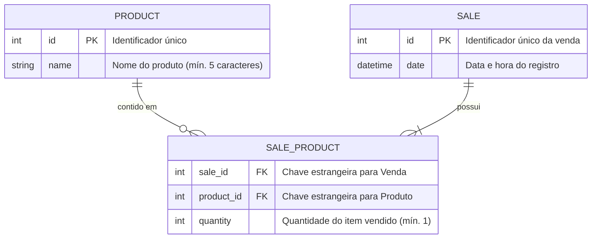

# 🛍️ Store Manager API

[](https://nodejs.org/)
[](https://www.typescriptlang.org/)
[](https://expressjs.com/)
[](https://www.prisma.io/)
[](https://www.mysql.com/)
[](https://www.sqlite.org/)
[](https://www.docker.com/)
[](https://swagger.io/)
[](https://github.com/features/actions)
[](https://opensource.org/licenses/MIT)

> 🇧🇷 **Português** | 🇺🇸 [**English Version**](README.en.md)

API RESTful para gestão de produtos e processamento de vendas, construída com arquitetura em camadas (**MSC - Model, Service, Controller**), tipagem estrita com **TypeScript**, persistência com **Prisma ORM**, suporte flexível a **MySQL 8.0** e **SQLite**, garantia de **transações atômicas (ACID)** e documentação interativa viva via **Swagger/OpenAPI**.

## 📌 Navegação Rápida

- [📝 Sobre o Projeto](#-sobre-o-projeto)
- [🖼️ Preview](#️-preview)
- [🌐 Demonstração Online do Swagger](#-demonstração-online-do-swagger)
- [⚡ API Endpoints](#-api-endpoints)
- [✨ Funcionalidades](#-funcionalidades)
- [🛠️ Tecnologias e Ferramentas Utilizadas](#️-tecnologias-e-ferramentas-utilizadas)
- [🏛️ Arquitetura da Solução](#️-arquitetura-da-solução)
- [📁 Estrutura do Repositório](#-estrutura-do-repositório)
- [💡 Decisões Técnicas](#-decisões-técnicas)
- [🚀 Como Executar o Projeto](#-como-executar-o-projeto)
- [📄 Licença](#-licença)

## 📝 Sobre o Projeto

O **Store Manager API** é uma solução de backend desenvolvida para simular operações essenciais de gestão comercial e controle de estoque de um varejo. O projeto foi projetado com foco em resiliência transacional, código limpo e padrões de nível de produção. 

Cada venda registrada processa múltiplos itens de forma atômica: se algum produto falhar na validação ou não existir no catálogo, toda a operação sofre reversão automática (*rollback*), evitando registros órfãos ou inconformidades de estoque.

O projeto opera nativamente com **MySQL 8.0** em desenvolvimento local e ambientes conteinerizados via Docker Compose, além de possuir configuração otimizada em **SQLite embutido** para permitir demonstração pública e hospedagem gratuita no Render.com com banco populado via seed automático.

## 🖼️ Preview


## 🌐 Demonstração Online do Swagger

Acesse a aplicação em produção:
👉 **[Store Manager API - Swagger UI](https://project-store-manager-w8is.onrender.com/api-docs/)**

## ⚡ API Endpoints

A documentação interativa detalha payloads, status codes e contratos de entrada e saída. A tabela abaixo resume as operações disponíveis:

| Método | Endpoint | Descrição | Status Sucesso |
| :--- | :--- | :--- | :--- |
| `GET` | `/health` | Verificação de status e conectividade com banco | `200 OK` |
| `GET` | `/api-docs` | Interface gráfica interativa Swagger UI | `200 OK` |
| `GET` | `/products` | Lista todos os produtos cadastrados | `200 OK` |
| `GET` | `/products/:id` | Busca detalhes de um produto específico | `200 OK` |
| `GET` | `/products/search?q=:termo` | Filtra produtos por correspondência de nome | `200 OK` |
| `POST` | `/products` | Cadastra um novo produto no estoque | `201 Created` |
| `PUT` | `/products/:id` | Atualiza os dados de um produto existente | `200 OK` |
| `DELETE` | `/products/:id` | Remove um produto do catálogo | `204 No Content` |
| `GET` | `/sales` | Lista todas as vendas e itens comercializados | `200 OK` |
| `GET` | `/sales/:id` | Detalha os itens de uma venda específica | `200 OK` |
| `POST` | `/sales` | Registra venda com múltiplos itens (Transação Atômica) | `201 Created` |
| `PUT` | `/sales/:id` | Atualiza os itens e quantidades de uma venda | `200 OK` |
| `DELETE` | `/sales/:id` | Cancela uma venda e remove suas associações em cascata | `204 No Content` |

## ✨ Funcionalidades

- **CRUD Completo de Produtos**: Inserção, listagem geral, detalhamento por ID, alteração e exclusão.
- **Busca Textual de Produtos**: Endpoint dedicado `/products/search?q=termo` com suporte a buscas vazias ou por termos parciais.
- **Processamento de Vendas em Lote**: Cadastro simultâneo de múltiplos itens e quantidades em uma única requisição.
- **Garantia de Atomicidade (ACID)**: Operações de venda executadas em `prisma.$transaction(...)`.
- **Integridade Referencial**: Relação de vendas e produtos vinculados com exclusão em cascata automática.
- **Diagnóstico em Tempo Real**: Endpoint `/health` que executa ping real no banco de dados e expõe métricas de uptime.
- **Redirecionamento Inteligente**: O acesso direto à raiz da aplicação (`/`) pelo navegador redireciona automaticamente para o Swagger.
- **Tratamento Centralizado de Erros**: Middleware global capturando exceções e formatando respostas JSON padronizadas com status HTTP semânticos (400, 404, 422, 500).

## 🛠️ Tecnologias e Ferramentas Utilizadas

| Camada / Finalidade | Tecnologia | Descrição |
| :--- | :--- | :--- |
| **Linguagem Principal** | **TypeScript 5.7** | Tipagem estática, contratos explícitos e verificação rigorosa em tempo de compilação |
| **Ambiente de Execução** | **Node.js 20 LTS** | Plataforma de execução JavaScript assíncrona orientada a eventos |
| **Framework Web** | **Express 4.21** | Framework minimalista e robusto para criação de APIs RESTful |
| **ORM / Acesso a Dados** | **Prisma ORM 5.22** | Mapeamento tipado de esquemas, migrações e cliente gerado com segurança de tipos |
| **Bancos de Dados** | **MySQL 8.0 & SQLite 3** | MySQL para ambiente padrão e SQLite embutido para demonstração no Render |
| **Documentação Interativa** | **Swagger UI / OpenAPI 3.0** | Especificação viva de API com console integrado para testes no navegador |
| **Testes Automatizados** | **Jest 29 & Supertest 7** | Suíte de testes de integração ponta a ponta cobrindo rotas, regras e banco |
| **Containerização** | **Docker & Docker Compose** | Multi-stage build otimizado em Alpine Linux e orquestração de containers |
| **Integração Contínua** | **GitHub Actions** | Pipeline automatizado de linting, compilação de tipos e execução de testes a cada push |
| **Hospedagem em Nuvem** | **Render.com** | Deploy contínuo com provisionamento automatizado via Blueprint (`render.yaml`) |

## 🏛️ Arquitetura da Solução

O projeto segue os princípios de separação de conceitos por meio da arquitetura **MSC (Model, Service, Controller)**, combinada a middlewares dedicados de validação e tratamento global de erros:

```mermaid
flowchart TD
    subgraph ClientLayer["Camada do Cliente"]
        User(["Navegador / Swagger UI"])
        ClientApp(["Clientes HTTP / Postman"])
    end

    subgraph RouterLayer["Roteamento e Middlewares"]
        Router["Express Routers (/products, /sales, /health)"]
        CorsMW["CORS Middleware"]
        ValProduct["Middleware de Validação de Produtos"]
        ValSale["Middleware de Validação de Vendas"]
        ErrorMW["Middleware Global de Erros (AppError)"]
    end

    subgraph BusinessLayer["Camada de Negócio (MSC)"]
        Controller["Controllers (ProductsController / SalesController)"]
        Service["Services (ProductsService / SalesService)"]
        Transaction["Transações Atômicas (prisma.$transaction)"]
    end

    subgraph DataLayer["Camada de Dados"]
        PrismaClient["Prisma Client (Type-Safe ORM)"]
        MySQL[(MySQL 8.0 - Local / Docker)]
        SQLite[(SQLite 3 - Render / Testes)]
    end

    User -->|Acessa /api-docs| Router
    ClientApp -->|Requisições HTTP REST| Router
    Router --> CorsMW
    CorsMW --> ValProduct
    CorsMW --> ValSale
    ValProduct --> Controller
    ValSale --> Controller
    Controller --> Service
    Service --> Transaction
    Transaction --> PrismaClient
    PrismaClient -.->|Ambiente Local / Docker| MySQL
    PrismaClient -.->|Deploy Nuvem / Testes| SQLite
    Service -.->|Exceções (400, 404, 422)| ErrorMW
    ErrorMW -->|Resposta Padronizada JSON| ClientApp
```

### Modelo Entidade-Relacionamento



## 📁 Estrutura do Repositório

```text
├── .github/
│   └── workflows/
│       └── ci.yml               # Pipeline de CI (Build e Testes no GitHub Actions)
├── prisma/
│   ├── schema.prisma            # Esquema Prisma para MySQL
│   ├── schema.sqlite.prisma     # Esquema Prisma otimizado para SQLite no Render
│   └── seed.ts                  # Script automatizado para carga de dados iniciais
├── src/
│   ├── config/
│   │   └── prisma.ts            # Instância compartilhada do PrismaClient
│   ├── controllers/
│   │   ├── products.controller.ts # Controle de requisições de produtos
│   │   └── sales.controller.ts    # Controle de requisições de vendas
│   ├── docs/
│   │   └── swagger.ts           # Definição OpenAPI 3.0 para o Swagger UI
│   ├── errors/
│   │   └── AppError.ts          # Classes especializadas de erro HTTP
│   ├── middlewares/
│   │   ├── errorHandler.ts      # Middleware global de captura de erros
│   │   ├── validateProduct.ts   # Validação de regras de produtos
│   │   └── validateSale.ts      # Validação de integridade de vendas
│   ├── routers/
│   │   ├── health.router.ts     # Rota de healthcheck do sistema
│   │   ├── products.router.ts   # Roteador de produtos
│   │   ├── sales.router.ts      # Roteador de vendas
│   │   └── index.ts             # Ponto central de exportação de rotas
│   ├── services/
│   │   ├── products.service.ts  # Regras de negócio de produtos
│   │   └── sales.service.ts     # Regras de negócio e transações de vendas
│   ├── app.ts                   # Configuração e inicialização do Express
│   └── server.ts                # Inicialização do servidor HTTP e bindings
├── tests/
│   ├── health.test.ts           # Testes de integração de healthcheck e raiz
│   ├── products.test.ts         # Testes de integração de produtos
│   ├── sales.test.ts            # Testes de integração de vendas e transações
│   └── setup.ts                 # Configuração de isolamento do banco de teste
├── Dockerfile                   # Dockerfile multi-stage com pré-seed
├── docker-compose.yml           # Orquestração do MySQL 8 e da API
├── jest.config.js               # Configuração do Jest para TypeScript
├── package.json                 # Metadados, scripts e dependências do projeto
├── render.yaml                  # Blueprint de infraestrutura para o Render.com
└── tsconfig.json                # Configuração estrita do compilador TypeScript
```

## 💡 Decisões Técnicas

1. **Adoção do TypeScript**: 
   A transição de JavaScript para TypeScript eliminou falhas de tipagem em tempo de execução, padronizou os contratos DTOs e habilitou o recurso de autocompletar e validação estática sincronizado diretamente com os modelos do Prisma.

2. **Garantia de Atomicidade com Prisma Interactive Transactions**:
   A criação de vendas envolve a gravação do registro mestre (`sales`) e de múltiplos registros associados (`sales_products`). O uso de `prisma.$transaction(...)` garante que qualquer inconsistência (ex: produto inexistente informado no payload) reverta imediatamente a operação sem criar registros corrompidos.

3. **Arquitetura Dual-Database (MySQL & SQLite)**:
   Projetos profissionais frequentemente demandam bancos robustos em produção empresarial (MySQL), mas custos zero para demonstrações de portfólio. Ao separar esquemas Prisma sem comprometer a regra de negócio, a aplicação roda tanto com MySQL via Docker quanto com SQLite embutido no Render.com.

4. **Tratamento Semântico de Exceções**:
   Substituição do retorno manual de códigos por lançamento de erros semânticos (`throw new NotFoundError(...)`). O `errorHandler` intercepta esses eventos centralizadamente, mantendo os Controllers limpos e as respostas HTTP uniformes.

5. **Swagger com URLs Relativas**:
   Configuração do Swagger com servidores apontando para `/`. Isso evita incidentes de CORS entre ambientes locais (localhost) e URLs públicas com protocolo HTTPS no Render.

## 🚀 Como Executar o Projeto

### Pré-requisitos
- **Node.js**: Versão 20 LTS (ou superior)
- **npm**: Versão 9 (ou superior)
- **Docker e Docker Compose** *(Opcional, para execução conteinerizada)*

### Opção 1: Execução Local com Node.js

1. **Clone o repositório:**
   ```bash
   git clone https://github.com/ludson96/project-store-manager.git
   cd project-store-manager
   ```

2. **Instale as dependências:**
   ```bash
   npm install --legacy-peer-deps
   ```

3. **Configure as variáveis de ambiente:**
   ```bash
   cp .env.example .env
   ```
   *Por padrão, o `.env` vem configurado para **MySQL**. Caso queira executar com **SQLite** localmente (modo idêntico ao Render), basta descomentar a linha do SQLite no arquivo `.env`.*

4. **Prepare o banco de dados e os dados iniciais (Seed):**
   - Para rodar com **MySQL** (com seu banco local ou container ativo):
     ```bash
     npm run setup:db
     ```
   - Para rodar com **SQLite** (Modo Demonstração sem necessidade de servidor de banco):
     ```bash
     npm run setup:sqlite
     ```

5. **Inicie o servidor de desenvolvimento:**
   ```bash
   npm run dev
   ```

6. **Acesse no navegador:**
   - 📖 **Swagger UI**: [http://localhost:3001/api-docs](http://localhost:3001/api-docs)
   - 🩺 **Health Check**: [http://localhost:3001/health](http://localhost:3001/health)

### Opção 2: Execução com Docker Compose (MySQL + API)

Para iniciar automaticamente o container do banco de dados **MySQL 8.0** e o container da **API Store Manager**:

```bash
docker-compose up --build -d
```
A API ficará acessível na porta `3001` e os dados do MySQL serão preservados no volume `mysql_data`.

### Executando a Suíte de Testes

Os testes automatizados utilizam um banco SQLite isolado temporário (`prisma/test.db`), permitindo que a suíte seja executada a qualquer momento sem necessidade de ter o MySQL ativo:

```bash
# Executa todos os testes de integração
npm test

# Executa testes com relatório de cobertura de código
npm run test:coverage
```

## 📄 Licença

Este projeto está sob a licença [MIT](LICENSE).

<div align="center">
  Desenvolvido por <strong>Ludson Pereira dos Santos</strong> 🚀<br />
  <a href="https://www.linkedin.com/in/ludson96/">LinkedIn</a> • <a href="https://github.com/ludson96">GitHub</a> • <a href="mailto:ludson_ps27@hotmail.com">E-mail</a>
</div>
